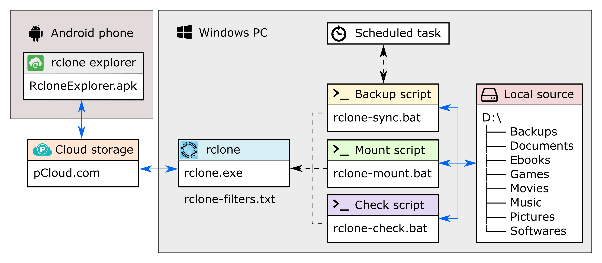

# rclone-backup

## About
Just my [rclone](https://rclone.org/) Windows batch scripts to backup / sync the second hard drive of my computer to [pCloud](https://www.pcloud.com/) (encrypted).



## Usage
### 1. Make local source and remote destination identical:
Example:
```
D:\                                         pCloudEncrypted:
├── Backups                                 ├── Backups
├── Documents                               ├── Documents
├── Ebooks                  sync            ├── Ebooks
├── Games                   --->            ├── Games
├── Movies                                  ├── Movies
├── Music                                   ├── Music
├── Pictures                                ├── Pictures
└── Softwares                               └── Softwares
(local source)                              (remote destination)
````
- Edit [configuration variables](https://rclone.org/commands/rclone_sync/) in `rclone-sync.bat`:
```bat
REM Configuration variables
SET RCLONE_EXE_PATH="%~dp0rclone.exe"
SET RCLONE_CONFIG_PATH="%~dp0rclone.conf"
SET RCLONE_LOG_FILE_PATH="%~dp0rclone-sync-log.txt"
REM Log level : DEBUG|INFO|NOTICE|ERROR (default NOTICE)
SET RCLONE_LOG_LEVEL=INFO
REM Read exclude patterns from file
SET RCLONE_FILTER_FILE_PATH="%~dp0rclone-filters.txt"
REM Number of checkers to run in parallel (default 8)
SET RCLONE_CHECKERS_NUMBER=8
REM Number of file transfers to run in parallel (default 4)
SET RCLONE_FILE_TRANSFERS_NUMBER=4
REM Number of low level retries to do (default 10)
SET RCLONE_LOW_LEVEL_RETRIES_NUMBER=10
REM Retry operations this many times if they fail (default 3)
SET RCLONE_RETRIES_NUMBER=10
REM Interval between retrying operations if they fail, e.g 500ms, 60s, 5m (0 to disable)
SET RCLONE_RETRIES_SLEEP=5s
REM Paths
SET RCLONE_LOCAL_PATH=D:\
SET RCLONE_REMOTE_PATH=pCloudEncrypted:
REM Local directory names to sync, comma separated
SET RCLONE_DIRECTORIES_TO_SYNC=Backups,Documents,Ebooks,Games,Movies,Music,Pictures,Softwares
REM Additional rclone flags
SET RCLONE_ADDITIONAL_FLAGS=--delete-excluded --progress --stats-one-line
```
- Edit your [filter file](https://rclone.org/filtering/) : `rclone-filters.txt`
- Start `rclone-sync.bat` with your rclone config file (`rclone.conf`) password (as argument or not):  
`rclone-sync.bat your-Rclone-Config-Password`  
:bulb: Note that you can use the `shutdown` or `hibernate` argument to shutdown / hibernate after sync:  
`rclone-sync.bat your-Rclone-Config-Password shutdown`
- Wait for rclone sync to complete

### 2. Mount remote as a mountpoint:
Example:
```
X:\                                         pCloudEncrypted:
├── Backups                                 ├── Backups
├── Documents                               ├── Documents
├── Ebooks                 mount            ├── Ebooks
├── Games                  <~~~~            ├── Games
├── Movies                                  ├── Movies
├── Music                                   ├── Music
├── Pictures                                ├── Pictures
└── Softwares                               └── Softwares
(local source)                              (remote destination)
````
- Edit [configuration variables](https://rclone.org/commands/rclone_mount/) in `rclone-mount.bat`:
```bat
REM Configuration variables
SET RCLONE_EXE_PATH="%~dp0rclone.exe"
SET RCLONE_CONFIG_PATH="%~dp0rclone.conf"
REM Paths
SET RCLONE_REMOTE_PATH=pCloudEncrypted:
SET RCLONE_LOCAL_DRIVE=X:
REM Buffer size when copying files (default 16M)
SET RCLONE_BUFFER_SIZE=64M
REM IO idle timeout (default 5m0s)
SET RCLONE_IO_IDLE_TIMEOUT=5s
REM Connect timeout (default 1m0s)
SET RCLONE_CONNECT_TIMEOUT=5s
REM Number of low level retries to do (default 10)
SET RCLONE_LOW_LEVEL_RETRIES_NUMBER=10
REM Retry operations this many times if they fail (default 3)
SET RCLONE_RETRIES_NUMBER=10
REM Interval between retrying operations if they fail, e.g 500ms, 60s, 5m (0 to disable)
SET RCLONE_RETRIES_SLEEP=0
REM Additional rclone flags
SET RCLONE_ADDITIONAL_FLAGS=--read-only
```
- [WinFsp](http://www.secfs.net/winfsp/) must be installed
- Start `rclone-mount.bat` with your rclone config file (`rclone.conf`) password (as argument or not):  
`rclone-mount.bat your-Rclone-Config-Password`
- Remote is mounted as a mountpoint
- Close console to unmount remote

### 3. Check the integrity of a crypted remote:
Example:
```
D:\                                         pCloudEncrypted:
├── Backups                                 ├── Backups
├── Documents                               ├── Documents
├── Ebooks                                  ├── Ebooks
├── Games                    MD5            ├── Games
├── Movies                  check           ├── Movies
├── Music                   <--->           ├── Music
├── Pictures                                ├── Pictures
└── Softwares                               └── Softwares
(local source)                              (remote destination)
````
- Edit [configuration variables](https://rclone.org/commands/rclone_cryptcheck/) in `rclone-check.bat`:
```bat
REM Configuration variables
SET RCLONE_EXE_PATH="%~dp0rclone.exe"
SET RCLONE_CONFIG_PATH="%~dp0rclone.conf"
SET RCLONE_LOG_FILE_PATH="%~dp0rclone-check-log.txt"
REM Log level : DEBUG|INFO|NOTICE|ERROR (default NOTICE)
SET RCLONE_LOG_LEVEL=NOTICE
REM Read exclude patterns from file
SET RCLONE_FILTER_FILE_PATH="%~dp0rclone-filters.txt"
REM Number of checkers to run in parallel (default 8)
SET RCLONE_CHECKERS_NUMBER=8
REM Number of file transfers to run in parallel (default 4)
SET RCLONE_FILE_TRANSFERS_NUMBER=4
REM Number of low level retries to do (default 10)
SET RCLONE_LOW_LEVEL_RETRIES_NUMBER=10
REM Retry operations this many times if they fail (default 3)
SET RCLONE_RETRIES_NUMBER=10
REM Interval between retrying operations if they fail, e.g 500ms, 60s, 5m (0 to disable)
SET RCLONE_RETRIES_SLEEP=5s
REM Paths
SET RCLONE_LOCAL_PATH=D:\
SET RCLONE_REMOTE_PATH=pCloudEncrypted:
REM Local directory names to sync, comma separated
SET RCLONE_DIRECTORIES_TO_SYNC=Backups,Documents,Ebooks,Games,Movies,Music,Pictures,Softwares
REM Additional rclone flags
SET RCLONE_ADDITIONAL_FLAGS=--delete-excluded
```
- Edit your [filter file](https://rclone.org/filtering/) : `rclone-filters.txt`
- Start `rclone-check.bat` with your rclone config file (`rclone.conf`) password (as argument or not):  
`rclone-check.bat your-Rclone-Config-Password`  
:bulb: Note that you can use the `shutdown` or `hibernate` argument to shutdown / hibernate after check:  
`rclone-check.bat your-Rclone-Config-Password shutdown`
- Wait for rclone cryptcheck to complete
- Search for errors in `rclone-check-log.txt` log file

### 4. Get quota information from the remote:
Example:
```
Total:   500G
Used:    260G
Free:    240G
```
- Edit [configuration variables](https://rclone.org/commands/rclone_about/) in `rclone-about.bat`:
```bat
REM Configuration variables
SET RCLONE_EXE_PATH="%~dp0rclone.exe"
SET RCLONE_CONFIG_PATH="%~dp0rclone.conf"
SET RCLONE_REMOTE_PATH=pCloudEncrypted:
```
- Start `rclone-about.bat` with your rclone config file (`rclone.conf`) password (as argument or not):  
`rclone-about.bat your-Rclone-Config-Password`
- Remote quota information is displayed

## Requirements
- [rclone](https://rclone.org/)
- Microsoft Windows
- [Windows File System Proxy](http://www.secfs.net/winfsp/)

## Todo
- Add more usefull rclone flags for sync / check / mount commands
  
## License
rclone-backup is released under the [Unlicense](http://unlicense.org).
